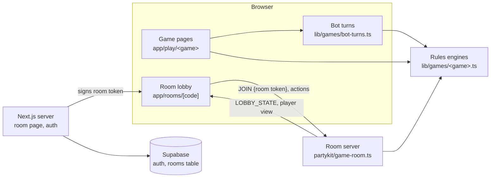

# Architecture

Words in **bold** are defined in [CONTEXT.md](CONTEXT.md).

## The idea

Every game's rules are a pure **rules engine**: a game state plus an **action** gives the next
state, with no React, network or hidden randomness. Everything else is a caller of that
interface:

- the four game pages, where a human plays against **bots** in the browser;
- the multiplayer **room** server, which keeps the real state and sends each player only their
  **player view**;
- the tests, which drive every engine through the same interface.

## Modules

| Module | Interface | Hides |
|---|---|---|
| Rules engines: `lib/games/{blackjack,crazy-eights,go-fish,yaniv}.ts` | `deal(…, rng?)`, `apply(state, action, rng?)`, `playerView(state, playerId)`, `activePlayer(state)` (`RulesEngine` in `lib/games/engine.ts`) | Legality, scoring, shuffles, turn order, per-game status |
| Bot turns: `lib/games/bot-turns.ts` | `botTurn`, `playBotTurns` over any engine | Asking the active player's bot and applying its action, with a turn guard |
| Bots: `lib/bots/*` | `getNextMove(state, playerId)` | Each bot's strategy (Yaniv's call pacing, Go Fish memory) |
| Game pages: `app/play/<game>/` | React routes | Pacing, animation, the win/loss tally; the Yaniv and Crazy Eights pages are split into session, settings and presentational modules (Yaniv adds feedback) |
| Room server: `partykit/game-room.ts` | PartyKit room; client messages `JOIN`, `START`, `CE_ACTION`, `GF_ACTION` | Lobby, host-only start, message parsing, per-player redaction, storage |
| Room tokens: `lib/room-token.ts` | `signRoomToken`, `verifyRoomToken` | HMAC-SHA256 signing (WebCrypto), expiry, claim parsing |
| Auth and data: `proxy.ts`, `app/actions/auth.ts`, `lib/supabase/*` | Supabase session refresh, sign-in/up actions, `findRoom(supabase, code)` | Cookie handling, safe post-sign-in redirects (`lib/redirect-path.ts`) |
| Card UI kit: `components/game/*` | Cards, hands, end-game screen, display settings | Layout per form factor, animation and colour preferences |

## House rules worth knowing

- Go Fish: a player with an empty hand doesn't draw a new one; the rules engine passes the turn to
  the next player who holds cards, so the active player always has a card to ask with. The game
  ends when the draw pile runs out, or as soon as every hand is empty, whatever the draw pile still
  holds.
- Yaniv: when your turn clock runs out, the table discards your highest card and draws from the
  draw pile for you (`timeoutMove` in `lib/games/yaniv.ts`).

## Randomness

Engines take an `Rng` (`() => number`, like `Math.random`). Pages use the default; tests pass
`seededRng(seed)` so a deal or a whole simulated game replays exactly; the room server passes
`cryptoRng` so nobody can predict a shuffle.

## Rooms: identity and redaction

1. The Next.js room page (`app/rooms/[code]/page.tsx`) knows the signed-in user and the room row.
   It signs `{room, userId, displayName, hostId, gameType, exp}` with `ROOM_TOKEN_SECRET`.
2. The lobby sends `JOIN {token}`. The room verifies the signature, room code and expiry and takes
   identity only from the claims; the first valid join opens the lobby with the host and game its
   token carries. HTTP requests to the
   room get `405`.
3. Sockets that have not joined receive nothing. Joined players receive `LOBBY_STATE`, then each
   gets `playerView` for themselves: their own hand, opponents' hand sizes, the draw pile's size.
   (Blackjack, which is never played in a room, flags the dealer's hole card face-down in its view
   rather than removing it.)
4. Every client message is parsed before it reaches an engine; oversized (over 4 KB) and
   malformed ones are dropped.
5. When the host starts, only the players connected at that moment are dealt in; anyone who left
   the lobby is dropped from the game.

The multiplayer game table is not built yet: after the host starts, the lobby shows "Full game UI
coming soon".

## Tests

- **Engines**: one suite per game next to its module, plus `lib/games/engine.test.ts`, a contract
  suite that runs the same checks over all four (seeded deals replay, out-of-turn actions are
  ignored, player views hide other hands and the draw pile, turn order ends when the game does).
- **Room server**: `partykit/game-room.test.ts` against an in-memory stand-in for the PartyKit
  runtime (forged tokens, impersonation, redaction, malformed messages).
- **Pages**: Testing Library tests drive all four game pages through what the player sees.
- **End to end**: `tests/e2e/smoke.spec.ts` deals each game from the home page in headless Chromium.
