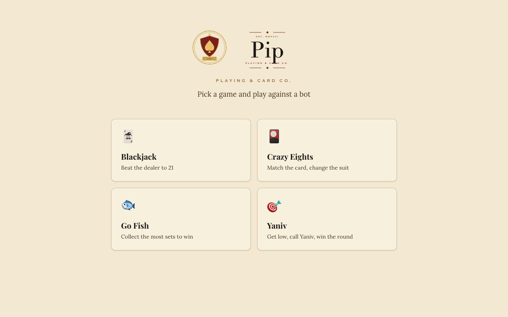
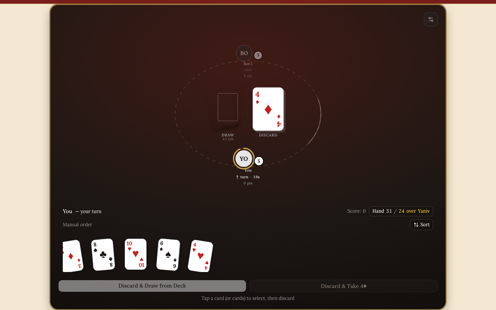

# Card Games

Four classic card games in the browser — **Yaniv**, **Blackjack**, **Crazy Eights** and
**Go Fish** — played against bots, built around pure, tested rules engines. Multiplayer rooms
(sign in, share a code, gather in a lobby) run on a server-authoritative PartyKit room; the
multiplayer game table itself is not built yet.





## What it does

- Yaniv against one to five bots, with the full scoring rules (Assaf, the 50/100 save rule, elimination), an optional
  Quick Draw rule, a turn clock and a round scoreboard.
- Crazy Eights against one to three bots, Go Fish against two, Blackjack against the dealer.
- Bots that take their turns at a readable pace; settings for card colours and animation speed.
- Multiplayer rooms: create a room, invite by link, wait in the lobby, host starts. Identity comes
  from a server-signed token and each player only ever receives their own view of the game.

## Quickstart

Prerequisites: Node 22+, pnpm 11 (`corepack enable` picks up the version in `package.json`).

```bash
pnpm install
cp .env.example .env.local
pnpm dev                 # http://localhost:3000
```

That is enough to play all four games against bots: no account, database or other service.

**Multiplayer rooms** additionally need:

1. A Supabase project (free tier works). Put its URL and anon key in `.env.local`, then apply
   `supabase/migrations/` with the Supabase CLI (`npx supabase link`, `npx supabase db push`).
2. A random `ROOM_TOKEN_SECRET` in `.env.local` (e.g. `openssl rand -hex 32`).
3. The room server in a second terminal: `pnpm dev:party` (PartyKit on :1999, reads `.env.local`).

## Testing

```bash
pnpm check                       # typecheck, lint, unit tests, production build
pnpm test                        # unit tests only (Vitest)
pnpm build && pnpm test:e2e      # headless Playwright smoke test on port 7121
```

Checks run locally; the repository has no CI.

- **Rules engines** are tested directly, and one contract suite runs the same checks over all four
  (a seeded deal replays exactly, out-of-turn actions are ignored, a player's view never contains
  another player's cards).
- **The room server** is tested against an in-memory stand-in for the PartyKit runtime: forged
  and foreign tokens, impersonation, redaction, malformed messages.
- **Pages** are tested through what a player sees (Testing Library); the end-to-end smoke test deals
  each game from the home page in headless Chromium. Nothing calls a network service.

## How it works

The rules of each game are a pure module with the same small interface (`deal`, `apply`,
`playerView`, `activePlayer`); the pages, the bot driver, the room server and the tests are all
callers of it. Randomness is passed in, so tests are deterministic and the server can shuffle with
a cryptographic source. [ARCHITECTURE.md](ARCHITECTURE.md) has the module map, the room protocol
and the redaction design; [CONTEXT.md](CONTEXT.md) defines the game terms.

| Path | What lives there |
|---|---|
| `lib/games/` | Rules engines, the engine interface, bot turns, card helpers |
| `lib/bots/` | One bot per game |
| `app/play/` | The four game tables |
| `partykit/` | The multiplayer room server |
| `app/rooms/`, `lib/room-token.ts` | Room lobby and signed room tokens |
| `components/game/` | Card and table UI shared by the games |
| `supabase/migrations/` | Database schema (auth profile, rooms) |

## Tech choices

| Choice | Why |
|---|---|
| Next.js App Router + React 19 | Server-rendered pages and server actions for auth; client tables for play |
| Pure TypeScript rules engines | The rules are the core: pure functions are easy to reason about, replay and test |
| PartyKit | One stateful room per game with WebSockets and storage, without running a server fleet |
| Supabase | Hosted auth and a small `rooms` table with row-level security |
| Vitest + Testing Library, Playwright | Fast unit and page tests; one real-browser smoke test |

## Project status

A portfolio project, finished as single-player against bots (2026). The multiplayer table for
rooms is not built; there is no public deployment. Not actively developed.

## How this was built

Built with AI coding agents (Claude Code, and Claude agents orchestrated through Paperclip) under
my direction; commit trailers name the agent on each change. I chose the games, the architecture
(pure engines, a server-authoritative room, per-player views) and the security model, and I
reviewed the changes and played the games to verify them. In October 2026 I ran a cleanup pass
with agents against written standards: a security audit (which found and fixed leaked hands and
spoofable room identity), a refactor into deep modules behind tested interfaces, and these docs.

## Licence

MIT — see [LICENSE](LICENSE).
